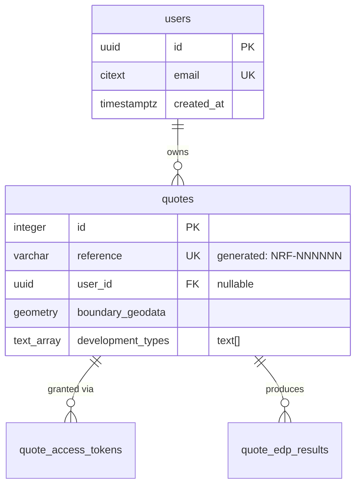

## What this does

Produces a Mermaid entity-relationship diagram (ERD) of the **quote database** —
the backend `nrf_backend` Postgres database (schema `public`) — and writes it to
`backend/docs/quote-database-diagram.md`. The diagram covers the application's domain tables, their
columns, primary/foreign keys, and the relationships between them.

The schema is read from the **live Postgres instance**, which is the required source of
truth. The **Liquibase changelog** under `backend/changelog/` is used only as a
cross-reference for intent (e.g. generated columns, default expressions) — never as the
sole source. If the live DB is unavailable, the skill stops rather than guessing from
the changelog.

## Scope — which tables

Include only the application's domain tables. **Exclude** infrastructure / framework
tables that are not part of the quote domain:

- `databasechangelog`, `databasechangeloglock` — Liquibase bookkeeping.
- `spatial_ref_sys` — PostGIS reference table (the DB image is `postgis/postgis`).

Do **not** hard-code the table list — derive it each run (see step 1) so the diagram
stays correct as migrations are added. Just apply the exclusion list above.

## Database access — connection details

The quote database runs in the `postgres` Docker service (image `postgis/postgis`)
defined in `backend/compose.yml`. Connect with `psql` **inside the container** via
`docker compose exec` — no local `psql` client or exposed port is required.

| Setting | Value | Source |
| --- | --- | --- |
| Service | `postgres` | `backend/compose.yml` |
| Database | `nrf_backend` | `POSTGRES_DB` |
| User | `postgres` | `POSTGRES_USER` |
| Password | `password` | `POSTGRES_PASSWORD` (local dev only) |
| Host port | `5432` (mapped to localhost) | `backend/compose.yml` ports |

Canonical command (run from the **`nrf-solution` root**, where `compose.yml` lives):

```
docker compose exec -T postgres psql -U postgres -d nrf_backend -c "<SQL>"
```

`-T` disables TTY allocation so the command is scriptable. The password is **not**
needed on the command line because `exec` runs as the trusted local socket user inside
the container.

**These are local-dev credentials only** (committed in `backend/compose.yml`). Real
environments get their secrets from CDP — never assume `postgres`/`password` off-box.

**Discovering these yourself:** if the values above ever drift, re-derive them from
`backend/compose.yml` — look at the `postgres` service's `environment:`
(`POSTGRES_DB` / `POSTGRES_USER` / `POSTGRES_PASSWORD`) and its `ports:` mapping.
`docker compose ps postgres` shows whether it's up and which port is published.

## Preconditions

The live DB is **required** — it is the only source of truth for the ERD. Confirm it
is reachable:

```
docker compose ps postgres
```

- If `postgres` is **up (healthy)**, proceed to step 1.
- If `postgres` is **not running**, **stop** and tell the user to start the stack
  (`tilt up` from the `nrf-solution` root). Do **not** generate the diagram from the
  Liquibase changelog alone — reconstructing cumulative migrations by hand is
  error-prone and would not reflect the actual database. The changelog is a reference
  for *intent* only (see "Cross-referencing the changelog"), never the sole source.

## Steps

### 1. List the in-scope tables

```
docker compose exec -T postgres psql -U postgres -d nrf_backend -t -A \
  -c "SELECT tablename FROM pg_tables WHERE schemaname='public' ORDER BY tablename;"
```

Drop the excluded tables listed under **Scope** above. The remainder is your table set.

### 2. Pull columns for each table

For each in-scope table, get column name, type, nullability and default. Query
`information_schema.columns` so the output is machine-parseable:

```
docker compose exec -T postgres psql -U postgres -d nrf_backend -t -A -F '|' \
  -c "SELECT column_name, data_type, is_nullable, column_default
      FROM information_schema.columns
      WHERE table_schema='public' AND table_name='<TABLE>'
      ORDER BY ordinal_position;"
```

You may also run `\d public.<table>` for a human-readable view that shows PK/unique/FK
constraints in one place — useful to sanity-check steps 3 and 4.

### 3. Identify primary keys

```
docker compose exec -T postgres psql -U postgres -d nrf_backend -t -A -F '|' \
  -c "SELECT kcu.table_name, kcu.column_name
      FROM information_schema.table_constraints tc
      JOIN information_schema.key_column_usage kcu
        ON tc.constraint_name = kcu.constraint_name
       AND tc.table_schema = kcu.table_schema
      WHERE tc.constraint_type='PRIMARY KEY' AND tc.table_schema='public'
      ORDER BY kcu.table_name, kcu.ordinal_position;"
```

### 4. Identify foreign keys (the relationships)

```
docker compose exec -T postgres psql -U postgres -d nrf_backend -t -A -F '|' \
  -c "SELECT tc.table_name AS child, kcu.column_name AS child_col,
             ccu.table_name AS parent, ccu.column_name AS parent_col
      FROM information_schema.table_constraints tc
      JOIN information_schema.key_column_usage kcu
        ON tc.constraint_name = kcu.constraint_name
       AND tc.table_schema = kcu.table_schema
      JOIN information_schema.constraint_column_usage ccu
        ON tc.constraint_name = ccu.constraint_name
       AND tc.table_schema = ccu.table_schema
      WHERE tc.constraint_type='FOREIGN KEY' AND tc.table_schema='public'
      ORDER BY tc.table_name;"
```

Each row is one relationship: `child.child_col` references `parent.parent_col`.

### 5. Build the Mermaid ERD

Assemble an `erDiagram`. Rules for a clean, valid diagram:

- One `TABLE { ... }` block per in-scope table, listing every column as
  `type name [PK|FK|UK] "comment"`.
- **Mermaid type tokens cannot contain spaces or parentheses.** Normalise Postgres
  types to single tokens, e.g.:
  - `character varying` / `character varying(255)` → `varchar`
  - `timestamp with time zone` → `timestamptz`
  - `double precision` → `double`
  - `ARRAY` (e.g. `text[]`) → `text_array` (note the real type in the column comment)
  - `USER-DEFINED` (e.g. `geometry`, `citext`) → use the underlying type name
    (`geometry`, `citext`) — confirm it via `\d` or `udt_name` in
    `information_schema.columns`.
  - keep simple ones as-is: `integer`, `uuid`, `text`, `jsonb`, `numeric`.
- Mark each column's key role: `PK` for primary key, `FK` for foreign-key columns
  (from step 4), `UK` for unique constraints if you want to surface them.
- Add a short `"comment"` for columns whose meaning isn't obvious from the name, and
  for generated/defaulted columns (e.g. `reference` is `generated always`, surface
  that from the changelog).
- Relationships: emit one line per FK. Use crow's-foot cardinality. A child row has
  exactly one parent; a parent has zero-or-many children, so:

  ```
  PARENT ||--o{ CHILD : "label"
  ```

  Pick a label that reads naturally (e.g. `places`, `has`, `belongs to`). If the FK
  column is nullable, the child side is optional — `}o` on the child is acceptable but
  `||--o{` is fine and conventional. Note nullability in a column comment instead of
  over-engineering the cardinality.

Example shape (illustrative — derive the real content from the queries):



### 6. Write the output file

Ensure the output directory exists, then write the diagram. The diagram lives in the
**backend submodule** (it documents the backend's own database), so the path is under
`backend/`. Run the skill from the `nrf-solution` root:

```
mkdir -p backend/docs
```

Write to `backend/docs/quote-database-diagram.md` a Markdown file containing:

1. A short H1 title and one-line description.
2. A line stating the **source** (live `nrf_backend` Postgres) and the **date
   generated** (use today's date).
3. The full ```mermaid erDiagram fenced block.
4. Optionally, a brief "Tables" section listing each table with a one-line purpose.

Use the `Write` tool for the file. If `backend/docs/quote-database-diagram.md` already
exists, overwrite it (this skill regenerates the canonical diagram) unless the user
asked to keep history — in that case suffix the filename with the date.

Note: `backend/` is a **git submodule**. The diagram is committed inside that submodule
(`backend`'s own repo), not the `nrf-solution` repo — stage it from within `backend/` when
committing.

### 7. Verify

- Re-read the written file with `Read`.
- Sanity-check the Mermaid is well-formed: every table referenced in a relationship
  line also has a `{ }` block; no type token contains a space or `(`; every `FK`
  column corresponds to a relationship line.
- Report the path written and a short summary (table count, relationship count).

## Cross-referencing the changelog

The Liquibase changelog under `backend/changelog/` is a **reference for intent only** —
never the sole source of the ERD. Use it to enrich the live-DB schema with context the
raw columns don't convey, for example:

- The meaning of a generated column (e.g. `quotes.reference` is `NRF-` + a hashed,
  zero-padded id, defined in a raw `<sql>` block).
- Why a default or constraint exists.

The diagram's structure (tables, columns, types, keys, relationships) always comes from
the live database. If Postgres is down, **stop** (see Preconditions) — do not
reconstruct the schema from the changelog.

## Notes

- This is the **backend / quote** database (`nrf_backend`). It is **not** the
  impact-assessor DB (`nrf_impact`, schema `nrf_reference`, Alembic migrations) —
  that is a separate database and out of scope unless the user asks for it.
- Keep the diagram focused on domain tables. Excluding Liquibase and PostGIS plumbing
  keeps it readable and is the whole point of curating the table set.
- The diagram is a generated artefact — regenerate it after schema-changing migrations
  rather than hand-editing the Markdown.
