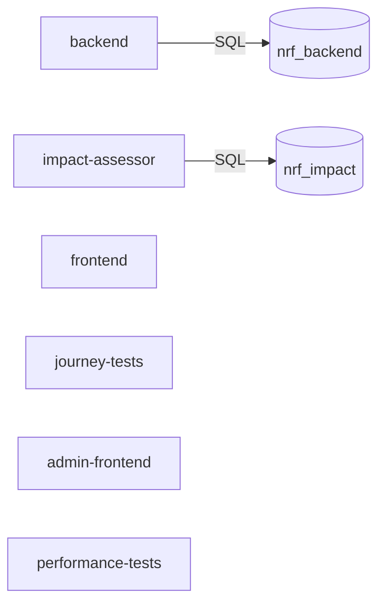
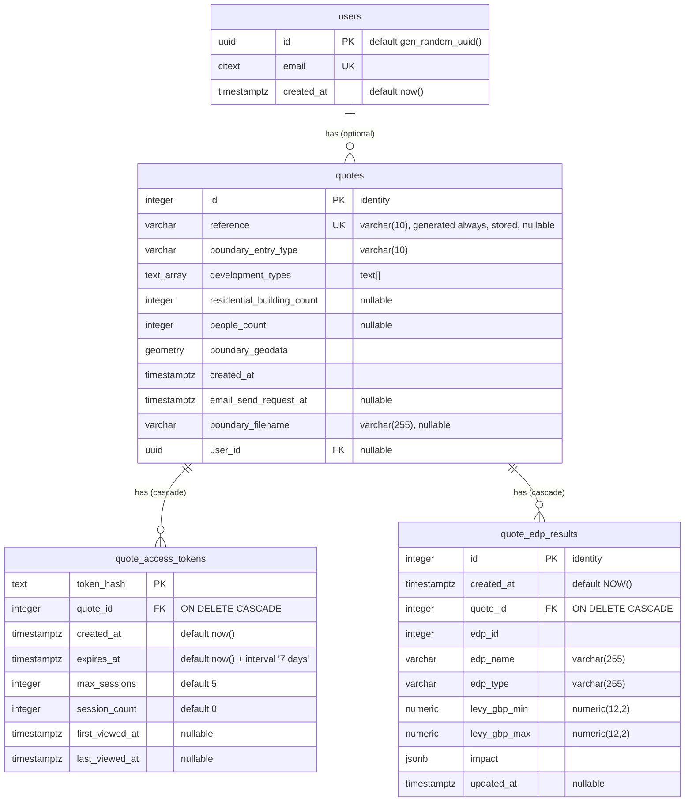
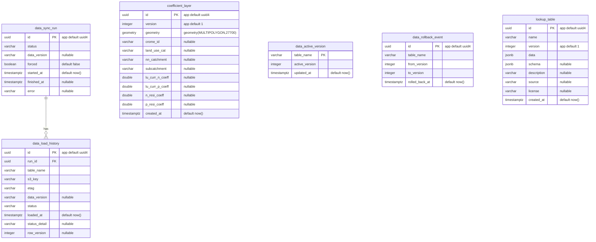
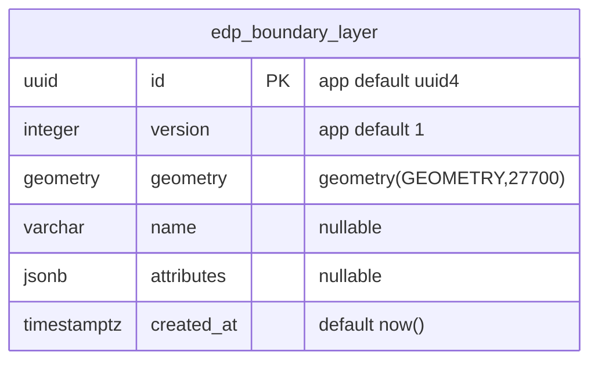

<!-- Generated by docs/db-schema/generate.js — do not edit by hand. -->

# Database schema

Every SQL table in the NRF service, across all repos, with entity-relationship diagrams. 19 tables in 2 databases.

**This file is generated.** Run `node docs/db-schema/generate.js` after any migration that adds, drops or alters a table or column. Editing it by hand will be overwritten, and CI checks that it matches the migration sources.

## Where the data lives

| Database | Schema | Owned by | Defined by | Domain tables |
| --- | --- | --- | --- | --- |
| `nrf_backend` | `public` | `backend` | Liquibase (`backend/changelog`) | 4 |
| `nrf_impact` | `public` | `impact-assessor` | Alembic (`impact-assessor/alembic/versions`), Liquibase (`impact-assessor/changelog`) | 15 |

`frontend`, `journey-tests`, `admin-frontend`, `performance-tests` own no SQL tables — no migration source of any kind was found in them.

Framework plumbing is excluded throughout: `databasechangelog`, `databasechangeloglock` (Liquibase), `alembic_version` (Alembic), and `spatial_ref_sys` with the `geometry_columns` / `geography_columns` views (PostGIS).

---

## `nrf_backend`

Owned by `backend`. 4 domain tables in schema `public`, defined by **Liquibase** (`backend/changelog`).

### Diagram

### Tables

#### `quote_access_tokens`

| Column | Type | Null | Default | Notes |
| --- | --- | --- | --- | --- |
| `token_hash` | `text` | no | — | **PK** |
| `quote_id` | `integer` | no | — | FK → `quotes.id` `ON DELETE CASCADE`; indexed |
| `created_at` | `timestamptz` | no | `now()` |  |
| `expires_at` | `timestamptz` | no | `now() + interval '7 days'` |  |
| `max_sessions` | `integer` | no | `5` |  |
| `session_count` | `integer` | no | `0` |  |
| `first_viewed_at` | `timestamptz` | yes | — |  |
| `last_viewed_at` | `timestamptz` | yes | — |  |

#### `quote_edp_results`

| Column | Type | Null | Default | Notes |
| --- | --- | --- | --- | --- |
| `id` | `integer` | no | — | **PK**; identity |
| `created_at` | `timestamptz` | no | `NOW()` |  |
| `quote_id` | `integer` | no | — | FK → `quotes.id` `ON DELETE CASCADE` |
| `edp_id` | `integer` | no | — |  |
| `edp_name` | `varchar(255)` | no | — |  |
| `edp_type` | `varchar(255)` | no | — |  |
| `levy_gbp_min` | `numeric(12,2)` | no | — |  |
| `levy_gbp_max` | `numeric(12,2)` | no | — |  |
| `impact` | `jsonb` | no | — |  |
| `updated_at` | `timestamptz` | yes | — |  |

#### `quotes`

| Column | Type | Null | Default | Notes |
| --- | --- | --- | --- | --- |
| `id` | `integer` | no | — | **PK**; identity |
| `reference` | `varchar(10)` | yes | — | unique; generated: `'NRF-' \|\| LPAD(((id::bigint * 2654435761) % 1000000)::text, 6, '0')` |
| `boundary_entry_type` | `varchar(10)` | no | — |  |
| `development_types` | `text[]` | no | — |  |
| `residential_building_count` | `integer` | yes | — |  |
| `people_count` | `integer` | yes | — |  |
| `boundary_geodata` | `geometry` | no | — |  |
| `created_at` | `timestamptz` | no | — |  |
| `email_send_request_at` | `timestamptz` | yes | — |  |
| `boundary_filename` | `varchar(255)` | yes | — |  |
| `user_id` | `uuid` | yes | — | FK → `users.id` |

#### `users`

| Column | Type | Null | Default | Notes |
| --- | --- | --- | --- | --- |
| `id` | `uuid` | no | `gen_random_uuid()` | **PK** |
| `email` | `citext` | no | — | unique |
| `created_at` | `timestamptz` | no | `now()` |  |

### Indexes and constraints

| Name | Table (columns) | Kind | Condition |
| --- | --- | --- | --- |
| `uq_quote_edp_results_quote_edp` | `quote_edp_results` (`quote_id`, `edp_id`) | UNIQUE constraint |  |
| _(unnamed)_ | `quotes` (`reference`) | UNIQUE constraint |  |
| _(unnamed)_ | `users` (`email`) | UNIQUE constraint |  |
| `idx_qat_quote` | `quote_access_tokens` (`quote_id`) | btree index |  |

### Why the schema looks like this

Recorded by whoever made the change, carried through from the migration sources.

**`quote_edp_results`** — Enforce one row per (quote_id, edp_id). A duplicate estimate callback previously inserted a second set of rows for the same quote, which let two access tokens be issued (the second expiring the first). The unique constraint lets a concurrent duplicate INSERT conflict instead of succeeding, so only one callback issues a token and emails the link.

_Liquibase changeset `17` in `db.changelog-2.1.xml`._

**`db.changelog-2.2.xml`** — reference is a stored generated column 'NRF-' || lpad(id * 2654435761 % 1000000, 6, 0). The multiplier is coprime with 1000000, so the mapping from id to reference is a bijection: a given id always yields the same reference. Every fresh database therefore reproduces the same references from id 1 onward (NRF-435761, NRF-871522, ...). Journey tests send the magic link to a fixed address on a shared Notify account, so a run could match another database's email for the same reference, whose access token does not exist locally, and the link reads as invalid. Start the sequence at a random offset so concurrent databases issue different references for the same row position. Skipped when rows already exist (e.g. an existing environment) so live references are never disturbed.

_Liquibase changeset `18` in `db.changelog-2.2.xml`._

---

## `nrf_impact`

Owned by `impact-assessor`. 15 domain tables in schema `public`, defined by **Alembic** (`impact-assessor/alembic/versions`) and **Liquibase** (`impact-assessor/changelog`).

> This database is defined twice — once per tool — and the two agree: the same 15 tables with the same columns. `scripts/check_migration_parity.py` enforces that every Alembic revision has a matching Liquibase changeset.

### Diagram

9 tables share one identical column set. It is drawn once, on `edp_boundary_layer`:

The same shape is used by `edp_edges`, `edp_excluded_areas`, `gcn_ponds`, `gcn_risk_zones`, `lpa_boundaries`, `nn_catchments`, `subcatchments`, `wwtw_catchments`. These tables carry no foreign keys — they are independent reference layers, joined spatially at query time.

### Tables

#### `coefficient_layer`

Dedicated model for coefficient polygons (5.4M records).

| Column | Type | Null | Default | Notes |
| --- | --- | --- | --- | --- |
| `id` | `uuid` | no | — | **PK**; application default `uuid4` — applied in Python, **not** by the database |
| `version` | `integer` | no | — | application default `1` — applied in Python, **not** by the database; indexed |
| `geometry` | `geometry(MULTIPOLYGON,27700)` | no | — |  |
| `crome_id` | `varchar` | yes | — | indexed |
| `land_use_cat` | `varchar` | yes | — |  |
| `nn_catchment` | `varchar` | yes | — | indexed |
| `subcatchment` | `varchar` | yes | — | indexed |
| `lu_curr_n_coeff` | `double precision` | yes | — |  |
| `lu_curr_p_coeff` | `double precision` | yes | — |  |
| `n_resi_coeff` | `double precision` | yes | — |  |
| `p_resi_coeff` | `double precision` | yes | — |  |
| `created_at` | `timestamptz` | no | `now()` |  |

#### `data_active_version`

Points at the version of each reference table that reads should use.

| Column | Type | Null | Default | Notes |
| --- | --- | --- | --- | --- |
| `table_name` | `varchar` | no | — | **PK** |
| `active_version` | `integer` | no | — |  |
| `updated_at` | `timestamptz` | no | `now()` |  |

#### `data_load_history`

Per-table audit row for a reload run.

| Column | Type | Null | Default | Notes |
| --- | --- | --- | --- | --- |
| `id` | `uuid` | no | — | **PK**; application default `uuid4` — applied in Python, **not** by the database |
| `run_id` | `uuid` | no | — | FK → `data_sync_run.id` |
| `table_name` | `varchar` | no | — | indexed |
| `s3_key` | `varchar` | no | — |  |
| `etag` | `varchar` | no | — |  |
| `data_version` | `varchar` | yes | — |  |
| `status` | `varchar` | no | — |  |
| `loaded_at` | `timestamptz` | no | `now()` | indexed |
| `status_detail` | `varchar` | yes | — |  |
| `row_version` | `integer` | yes | — |  |

#### `data_rollback_event`

Audit row for one table's active-version rollback.

| Column | Type | Null | Default | Notes |
| --- | --- | --- | --- | --- |
| `id` | `uuid` | no | — | **PK**; application default `uuid4` — applied in Python, **not** by the database |
| `table_name` | `varchar` | no | — |  |
| `from_version` | `integer` | no | — |  |
| `to_version` | `integer` | no | — |  |
| `rolled_back_at` | `timestamptz` | no | `now()` |  |

#### `data_sync_run`

Async reload job record. Status: 'running' | 'success' | 'failed'.

| Column | Type | Null | Default | Notes |
| --- | --- | --- | --- | --- |
| `id` | `uuid` | no | — | **PK**; application default `uuid4` — applied in Python, **not** by the database |
| `status` | `varchar` | no | — |  |
| `data_version` | `varchar` | yes | — |  |
| `forced` | `boolean` | no | `false` |  |
| `started_at` | `timestamptz` | no | `now()` |  |
| `finished_at` | `timestamptz` | yes | — |  |
| `error` | `varchar` | yes | — |  |

#### `edp_boundary_layer`

Dedicated model for EDP boundary polygons.

| Column | Type | Null | Default | Notes |
| --- | --- | --- | --- | --- |
| `id` | `uuid` | no | — | **PK**; application default `uuid4` — applied in Python, **not** by the database |
| `version` | `integer` | no | — | application default `1` — applied in Python, **not** by the database; indexed |
| `geometry` | `geometry(GEOMETRY,27700)` | no | — | indexed |
| `name` | `varchar` | yes | — | indexed |
| `attributes` | `jsonb` | yes | — |  |
| `created_at` | `timestamptz` | no | `now()` |  |

#### `edp_edges`

Environmental designation polygon edges used in GCN assessment.

| Column | Type | Null | Default | Notes |
| --- | --- | --- | --- | --- |
| `id` | `uuid` | no | — | **PK**; application default `uuid4` — applied in Python, **not** by the database |
| `version` | `integer` | no | — | application default `1` — applied in Python, **not** by the database; indexed |
| `geometry` | `geometry(GEOMETRY,27700)` | no | — | indexed |
| `name` | `varchar` | yes | — | indexed |
| `attributes` | `jsonb` | yes | — |  |
| `created_at` | `timestamptz` | no | `now()` |  |

#### `edp_excluded_areas`

Buffered SSSI exclusion-area polygons (nutrient EDP).

| Column | Type | Null | Default | Notes |
| --- | --- | --- | --- | --- |
| `id` | `uuid` | no | — | **PK**; application default `uuid4` — applied in Python, **not** by the database |
| `version` | `integer` | no | — | application default `1` — applied in Python, **not** by the database; indexed |
| `geometry` | `geometry(GEOMETRY,27700)` | no | — | indexed |
| `name` | `varchar` | yes | — | indexed |
| `attributes` | `jsonb` | yes | — |  |
| `created_at` | `timestamptz` | no | `now()` |  |

#### `gcn_ponds`

National ponds dataset used for GCN assessment.

| Column | Type | Null | Default | Notes |
| --- | --- | --- | --- | --- |
| `id` | `uuid` | no | — | **PK**; application default `uuid4` — applied in Python, **not** by the database |
| `version` | `integer` | no | — | application default `1` — applied in Python, **not** by the database; indexed |
| `geometry` | `geometry(GEOMETRY,27700)` | no | — | indexed |
| `name` | `varchar` | yes | — | indexed |
| `attributes` | `jsonb` | yes | — |  |
| `created_at` | `timestamptz` | no | `now()` |  |

#### `gcn_risk_zones`

GCN (great crested newt) risk zone polygons (red/amber/green).

| Column | Type | Null | Default | Notes |
| --- | --- | --- | --- | --- |
| `id` | `uuid` | no | — | **PK**; application default `uuid4` — applied in Python, **not** by the database |
| `version` | `integer` | no | — | application default `1` — applied in Python, **not** by the database; indexed |
| `geometry` | `geometry(GEOMETRY,27700)` | no | — | indexed |
| `name` | `varchar` | yes | — | indexed |
| `attributes` | `jsonb` | yes | — |  |
| `created_at` | `timestamptz` | no | `now()` |  |

#### `lookup_table`

JSONB-based storage for lookup tables (WwTW, rates).

| Column | Type | Null | Default | Notes |
| --- | --- | --- | --- | --- |
| `id` | `uuid` | no | — | **PK**; application default `uuid4` — applied in Python, **not** by the database |
| `name` | `varchar` | no | — | indexed |
| `version` | `integer` | no | — | application default `1` — applied in Python, **not** by the database; indexed |
| `data` | `jsonb` | no | — |  |
| `schema` | `jsonb` | yes | — |  |
| `description` | `varchar` | yes | — |  |
| `source` | `varchar` | yes | — |  |
| `license` | `varchar` | yes | — |  |
| `created_at` | `timestamptz` | no | `now()` |  |

#### `lpa_boundaries`

Local planning authority boundary polygons.

| Column | Type | Null | Default | Notes |
| --- | --- | --- | --- | --- |
| `id` | `uuid` | no | — | **PK**; application default `uuid4` — applied in Python, **not** by the database |
| `version` | `integer` | no | — | application default `1` — applied in Python, **not** by the database; indexed |
| `geometry` | `geometry(GEOMETRY,27700)` | no | — | indexed |
| `name` | `varchar` | yes | — | indexed |
| `attributes` | `jsonb` | yes | — |  |
| `created_at` | `timestamptz` | no | `now()` |  |

#### `nn_catchments`

Nutrient neutrality catchment polygons.

| Column | Type | Null | Default | Notes |
| --- | --- | --- | --- | --- |
| `id` | `uuid` | no | — | **PK**; application default `uuid4` — applied in Python, **not** by the database |
| `version` | `integer` | no | — | application default `1` — applied in Python, **not** by the database; indexed |
| `geometry` | `geometry(GEOMETRY,27700)` | no | — | indexed |
| `name` | `varchar` | yes | — | indexed |
| `attributes` | `jsonb` | yes | — |  |
| `created_at` | `timestamptz` | no | `now()` |  |

#### `subcatchments`

Sub-catchment polygons.

| Column | Type | Null | Default | Notes |
| --- | --- | --- | --- | --- |
| `id` | `uuid` | no | — | **PK**; application default `uuid4` — applied in Python, **not** by the database |
| `version` | `integer` | no | — | application default `1` — applied in Python, **not** by the database; indexed |
| `geometry` | `geometry(GEOMETRY,27700)` | no | — | indexed |
| `name` | `varchar` | yes | — | indexed |
| `attributes` | `jsonb` | yes | — |  |
| `created_at` | `timestamptz` | no | `now()` |  |

#### `wwtw_catchments`

WwTW (wastewater treatment works) catchment polygons.

| Column | Type | Null | Default | Notes |
| --- | --- | --- | --- | --- |
| `id` | `uuid` | no | — | **PK**; application default `uuid4` — applied in Python, **not** by the database |
| `version` | `integer` | no | — | application default `1` — applied in Python, **not** by the database; indexed |
| `geometry` | `geometry(GEOMETRY,27700)` | no | — | indexed |
| `name` | `varchar` | yes | — | indexed |
| `attributes` | `jsonb` | yes | — |  |
| `created_at` | `timestamptz` | no | `now()` |  |

### Indexes and constraints

| Name | Table (columns) | Kind | Condition |
| --- | --- | --- | --- |
| `uq_lookup_name_version` | `lookup_table` (`name`, `version`) | UNIQUE constraint |  |
| `ix_public_coefficient_layer_crome_id` | `coefficient_layer` (`crome_id`) | btree index |  |
| `ix_public_coefficient_layer_geom_v1` | `coefficient_layer` (`geometry`) | GIST index, partial | `WHERE version = 1` |
| `ix_public_coefficient_layer_nn_catchment` | `coefficient_layer` (`nn_catchment`) | btree index |  |
| `ix_public_coefficient_layer_subcatchment` | `coefficient_layer` (`subcatchment`) | btree index |  |
| `ix_public_coefficient_layer_version` | `coefficient_layer` (`version`) | btree index |  |
| `ix_data_load_history_table_loaded_at` | `data_load_history` (`table_name`, `loaded_at`) | btree index |  |
| `uq_data_sync_run_single_running` | `data_sync_run` (`status`) | UNIQUE btree index, partial | `WHERE status = 'running'` |
| `ix_public_edp_boundary_layer_geometry` | `edp_boundary_layer` (`geometry`) | GIST index |  |
| `ix_public_edp_boundary_layer_geometry` | `edp_boundary_layer` (`geometry`) | GIST index |  |
| `ix_public_edp_boundary_layer_name` | `edp_boundary_layer` (`name`) | btree index |  |
| `ix_public_edp_boundary_layer_name` | `edp_boundary_layer` (`name`) | btree index |  |
| `ix_public_edp_boundary_layer_version` | `edp_boundary_layer` (`version`) | btree index |  |
| `ix_public_edp_boundary_layer_version` | `edp_boundary_layer` (`version`) | btree index |  |
| `ix_public_edp_edges_geometry` | `edp_edges` (`geometry`) | GIST index |  |
| `ix_public_edp_edges_name` | `edp_edges` (`name`) | btree index |  |
| `ix_public_edp_edges_version` | `edp_edges` (`version`) | btree index |  |
| `ix_public_edp_excluded_areas_geometry` | `edp_excluded_areas` (`geometry`) | GIST index |  |
| `ix_public_edp_excluded_areas_name` | `edp_excluded_areas` (`name`) | btree index |  |
| `ix_public_edp_excluded_areas_version` | `edp_excluded_areas` (`version`) | btree index |  |
| `ix_public_gcn_ponds_geometry` | `gcn_ponds` (`geometry`) | GIST index |  |
| `ix_public_gcn_ponds_name` | `gcn_ponds` (`name`) | btree index |  |
| `ix_public_gcn_ponds_version` | `gcn_ponds` (`version`) | btree index |  |
| `ix_public_gcn_risk_zones_geometry` | `gcn_risk_zones` (`geometry`) | GIST index |  |
| `ix_public_gcn_risk_zones_name` | `gcn_risk_zones` (`name`) | btree index |  |
| `ix_public_gcn_risk_zones_version` | `gcn_risk_zones` (`version`) | btree index |  |
| `ix_public_lookup_table_name` | `lookup_table` (`name`) | btree index |  |
| `ix_public_lookup_table_version` | `lookup_table` (`version`) | btree index |  |
| `ix_public_lpa_boundaries_geometry` | `lpa_boundaries` (`geometry`) | GIST index |  |
| `ix_public_lpa_boundaries_name` | `lpa_boundaries` (`name`) | btree index |  |
| `ix_public_lpa_boundaries_version` | `lpa_boundaries` (`version`) | btree index |  |
| `ix_public_nn_catchments_geometry` | `nn_catchments` (`geometry`) | GIST index |  |
| `ix_public_nn_catchments_name` | `nn_catchments` (`name`) | btree index |  |
| `ix_public_nn_catchments_version` | `nn_catchments` (`version`) | btree index |  |
| `ix_public_subcatchments_geometry` | `subcatchments` (`geometry`) | GIST index |  |
| `ix_public_subcatchments_name` | `subcatchments` (`name`) | btree index |  |
| `ix_public_subcatchments_version` | `subcatchments` (`version`) | btree index |  |
| `ix_public_wwtw_catchments_geometry` | `wwtw_catchments` (`geometry`) | GIST index |  |
| `ix_public_wwtw_catchments_name` | `wwtw_catchments` (`name`) | btree index |  |
| `ix_public_wwtw_catchments_version` | `wwtw_catchments` (`version`) | btree index |  |

> **Application-side defaults.** 26 columns take their default from the application, not the database — SQLAlchemy `default=` is applied in Python when the model is instantiated. A raw `INSERT` that omits them will fail. They are marked in the tables above.

---

## Non-SQL stores

Out of scope for the diagrams above — they hold no tables — but listed so the picture is complete. Found in `compose.yml`.

| Store | Compose service | Image |
| --- | --- | --- |
| LocalStack (emulates AWS S3 / SQS / SNS) | `localstack` | `localstack/localstack:3.2.0` |
| MongoDB | `mongodb` | `mongo:7.0` |
| Redis | `redis` | `redis:7.2.3-alpine3.18` |

---

## How this is produced

The migration sources are the input — no live database is required, so this runs in CI. Sources are discovered by scanning the tree rather than being listed, so a new service with its own database is picked up rather than silently missed.

| Source | Tool | Database |
| --- | --- | --- |
| `backend/changelog` | Liquibase | `nrf_backend` |
| `impact-assessor/alembic/versions` | Alembic | `nrf_impact` |
| `impact-assessor/changelog` | Liquibase | `nrf_impact` _(inferred from the alembic source in the same repo)_ |

Three things the generator is careful about, each of which produced a wrong answer first time:

- **Liquibase `<rollback>` blocks hold the inverse operation.** An `addColumn` changeset contains a `dropColumn` rollback, so parsing rollbacks as real operations cancels out every column ever added. They are stripped before parsing.
- **Alembic's `downgrade()` is the same trap.** Only `upgrade()` is read, and revisions are applied in `down_revision` order — the later revision ids are content hashes and sort arbitrarily by filename.
- **Schema-changing DDL also arrives as raw SQL.** `quotes.reference` exists only in a raw `<sql>` block, and `quote_edp_results` was dropped and recreated there with a different column set. Raw SQL is parsed, and anything unrecognised fails the build rather than being skipped.

### Cross-checks

Each run verifies the sources against each other and fails if they disagree:

- `nrf_impact`: Alembic vs Liquibase — agree
- `nrf_impact`: migrations vs `impact-assessor/app/models/db.py` — agree

### Other diagrams that disagree with this schema

Hand-maintained ER diagrams found elsewhere in the tree that no longer match the migration sources. A stale diagram looks exactly like a fresh one, which is how gap **G14** went unnoticed — so they are checked on every run.

- `backend/docs/quote-database-diagram.md`
  - `quotes` lists dropped columns: waste_water_treatment_works_id, waste_water_treatment_works_name
