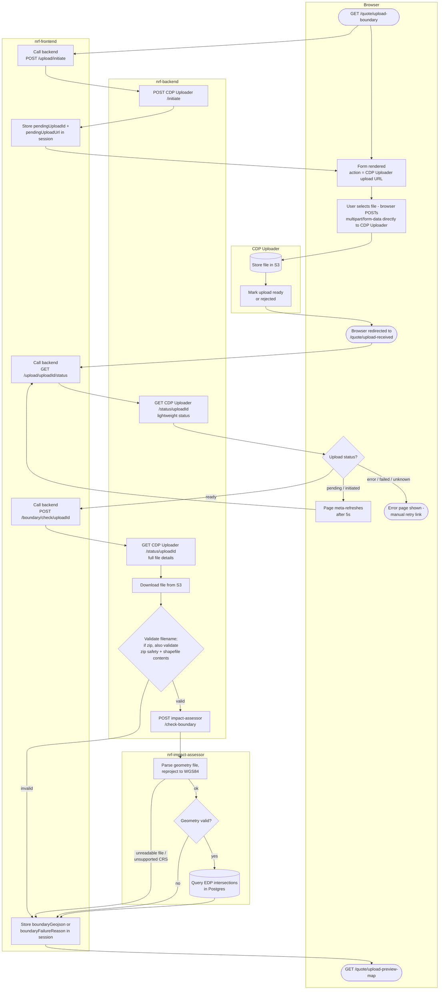

# Boundary file upload — complete flow

How a red line boundary file moves from the browser, through CDP Uploader, nrf-frontend
and nrf-backend, to nrf-impact-assessor and back — starting at `/quote/upload-boundary`.
Covers the happy path, the poll-while-processing loop, and where each service's
validation sits.

> **File goes browser → CDP Uploader directly:** the actual file bytes never pass through
> nrf-frontend or nrf-backend. `/upload/initiate` only asks CDP Uploader for a one-time
> upload URL and ID; the browser's `<form>` posts the file straight to that URL, and CDP
> Uploader redirects the browser to `/quote/upload-received` once it has stored the file
> in S3.

> **"Ready" doesn't mean "accepted":** CDP Uploader can mark an upload `ready` even when
> it rejected the file itself (virus scan failure, over the size limit). The lightweight
> status check (`N`) only tells the frontend when to stop polling — the rejection is only
> discovered when nrf-backend calls CDP Uploader's status endpoint again for full file
> details (`O`) as part of `/boundary/check/{uploadId}`.

> **Backend, not impact-assessor, owns file/zip validation:** filename safety, zip-bomb
> and zip-slip checks, and shapefile-companion-file checks all happen in nrf-backend
> before the file is ever sent to nrf-impact-assessor. Impact-assessor only receives a
> file it can assume is already a safe, well-formed archive, and its job is limited to
> geometry parsing/validation and EDP intersection lookups.

> **Every failure is a machine-readable code:** nrf-backend and nrf-impact-assessor never
> return display text — only a stable code (e.g. `unsupported_crs`, `zip_missing_shapefile`).
> nrf-frontend is the only place that maps a code to user-facing copy
> (`constants/boundary-error-messages.js`), so wording can change without touching either
> service.
