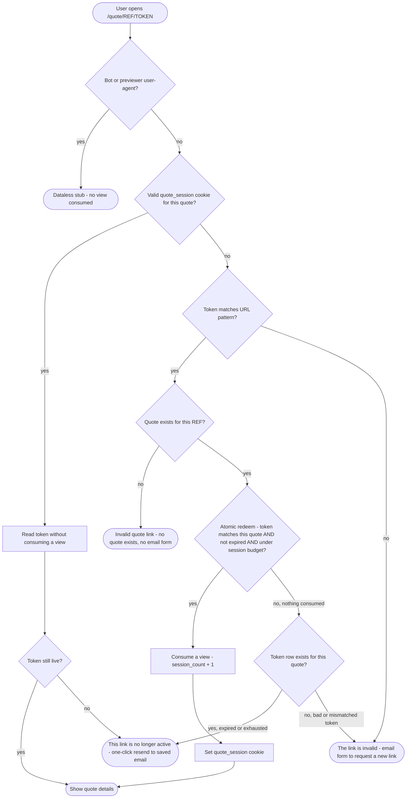

# Quote access link — complete flow

How a user reaches their quote details page (or an error) from a magic link email.
Covers all scenarios: first view, repeat visits, bot detection, expired/invalid/replaced
tokens, and session budget exhaustion.

> **Invalid token vs invalid reference:** the email form is offered only when there is a
> real quote behind the link — i.e. the *token* is bad (malformed, expired, exhausted or
> belongs to a different quote) but the reference resolves to an existing quote. In that
> case the user can recover by entering their email. When the *reference itself* matches
> no quote, there is nothing to recover, so the page is a dead-end ("Invalid quote link")
> with no email form.
>
> **Link replaced after edit:** when a user edits and resubmits their quote, the old
> token is invalidated and a new one issued. The old link follows the `time-expired`
> path (the replaced token's expiry is set to the past) and shows "This link is no
> longer active". The new email link works normally from `start`.
