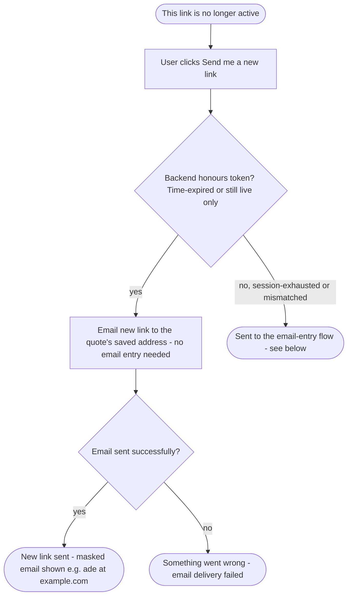
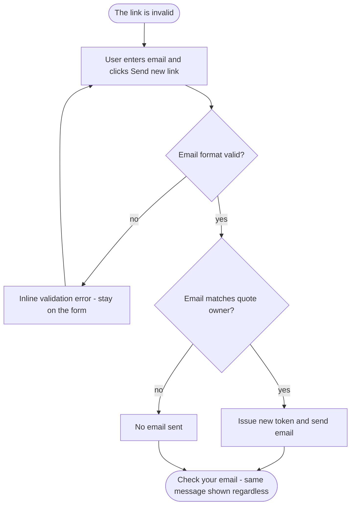

# Quote link resend — flows

Two separate resend journeys, each reached from a different error page.

## One-click resend (known expired link)

Reached from the **"This link is no longer active"** page. The system still holds a
record of the token, so possession of it is treated as proof of ownership — the user
just clicks a button, no email entry needed.

The token is only honoured if it is genuinely time-expired (or still live). A
session-exhausted token is rejected so a user cannot reset their view budget by
requesting a new link; they are sent to the email-entry flow instead.

## Email-entry resend (invalid token, real quote)

Reached from the **"The link is invalid"** page (and from a rejected one-click resend
above). The system cannot verify ownership from the token alone, so the user enters the
email address they used for the quote.

The confirmation is always identical whether or not the email matched, so a caller
cannot discover whether a quote or email address exists.

> **Note:** a link whose NRF reference matches no quote does **not** reach either resend
> flow — it is a dead-end "Invalid quote link" page with no button or email field, because
> there is no quote to send a new link for.
